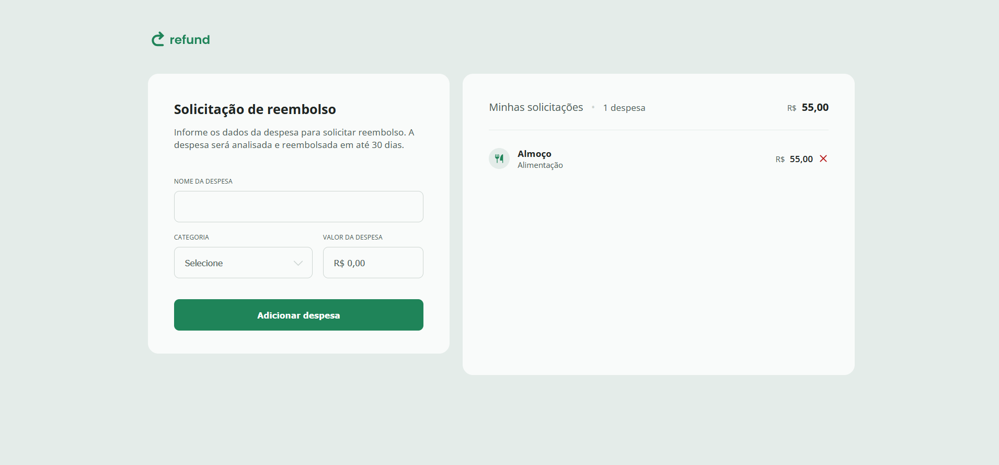

# 💸 Refund - Sistema de Solicitação de Reembolso

Um projeto prático de front-end que simula uma aplicação de controle de reembolsos. Com ele, é possível adicionar despesas com nome, categoria e valor, além de visualizar o total reembolsável e remover despesas listadas.

Desenvolvido com HTML, CSS e JavaScript puro, este projeto faz parte do meu aprendizado na **Trilha Full Stack da Rocketseat**, no módulo de **JavaScript Intermediário**.

## 📸 Preview

## ✨ Funcionalidades

- ✅ Adicionar nova despesa
- ✅ Selecionar categoria da despesa
- ✅ Informar valor (com máscara monetária)
- ✅ Listar despesas adicionadas
- ✅ Exibir o valor total a ser reembolsado
- ✅ Remover despesas da lista

## 🛠️ Tecnologias Utilizadas

- HTML5
- CSS3
- JavaScript (vanilla)

## 🚀 Como rodar o projeto

1. Clone este repositório:
git clone https://github.com/JanieleCristina006/Refund/tree/main

